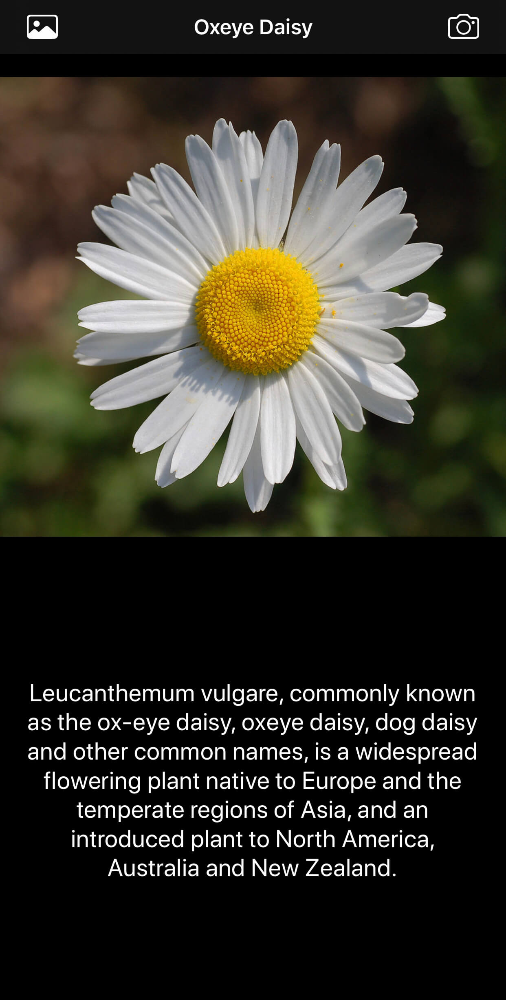

# Flower Identifier
Flower identification within images or photos with Core ML.

The Wikipedia API is used to retrieve the flower info.

Implementation of oxford102.caffemodel converted to a Core ML model.

  

  

  

