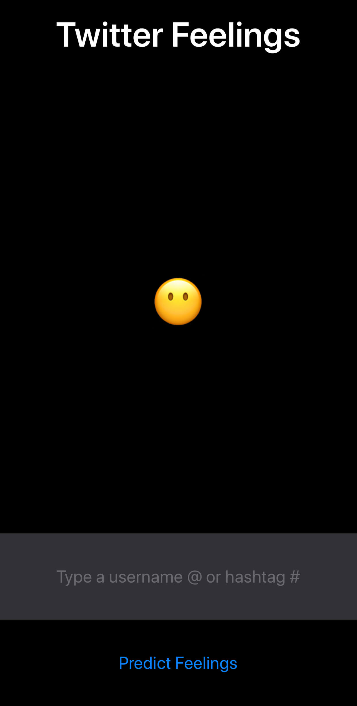

# Twitter Feelings
Identifier of the average sentiment of a user's tweets or about a topic.

Implementation of a Core ML model made and trained by me with Create ML. The model tells if the tweet is neutral, posivite or negative.

Twitter API is used to fetch the required tweets.

  

  

